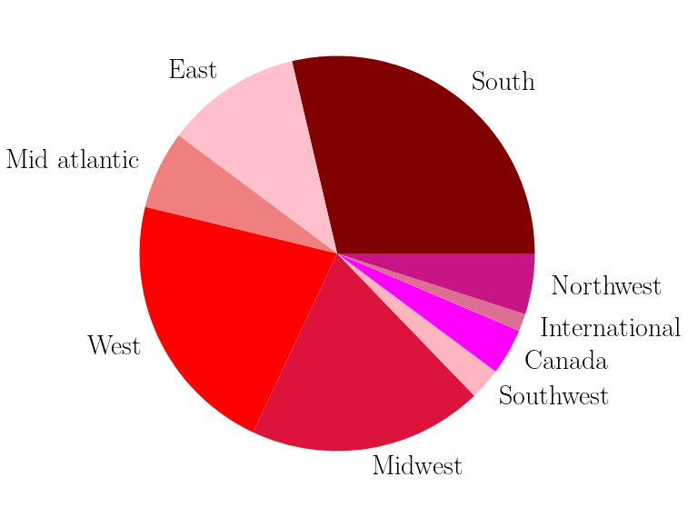
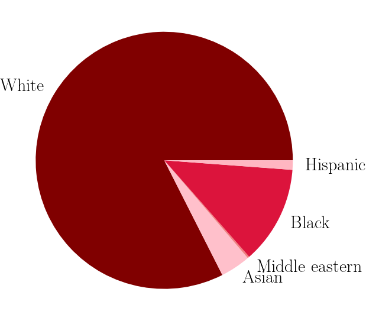
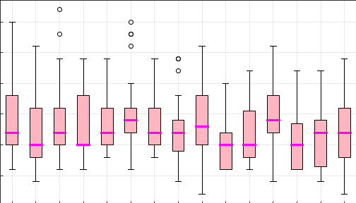

 

# bach-stats :rose:
Authors: Abigail Lee, Grace E. Chesmore

Email: [abbyl@uchicago.edu](mailto:abbyl@uchicago.edu)

Email: [chesmore@uchicago.edu](mailto:chesmore@uchicago.edu)

Statistical analysis of The Bachelor dataset, going back the past 14 seasons of the reality show.  We begin by classifying the contestants into categories.  The pie charts show the distribution of race and hometown, and the lower plot shows the age distribution of all contestants during the past 14 seasons.

     
     
    <figcaption style="padding-bottom:30px"> <i> Left: Distribution of contestant Hometowns. The South is the most highly represented hometown region from The Bachelor, representing about 29% of contestants.  Right: Distribution of contestant race. White women overwhelmingly dominate the contestants from The Bachelor, representing about 82% of contestants. </i> </figcaption>

     
    <figcaption style="padding-bottom:30px"> <i> Age distribution of The Bachelor contestants in the dataset, which covers the last 14 seasons. </i> </figcaption>

We then use these categories to predict the success of a given contestant.  We use 1) an ordinary least-squares linear regression machine learning model, 2) a Gaussian profile regression machine learning model, and 3) neural networks.  
